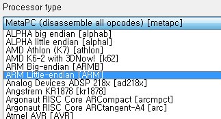
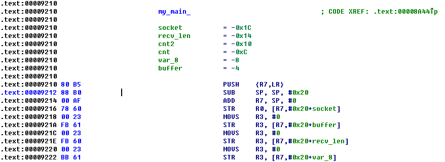
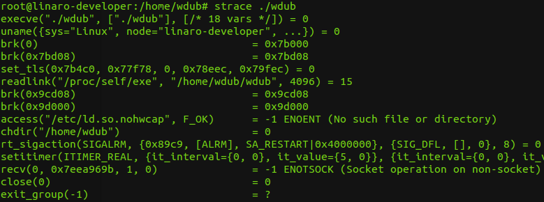
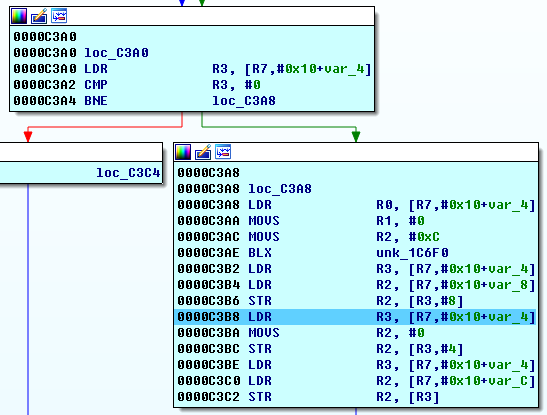
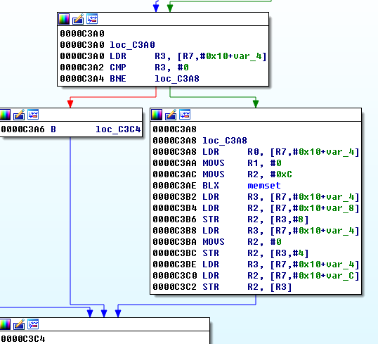
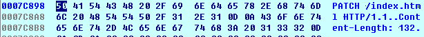
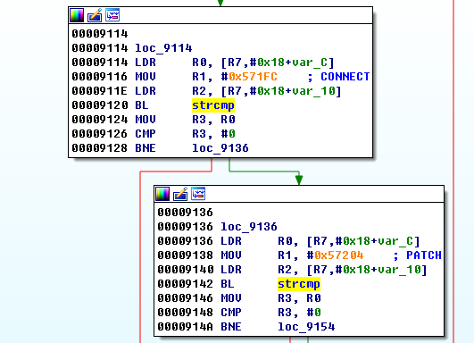
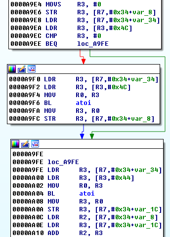
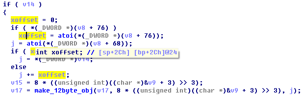
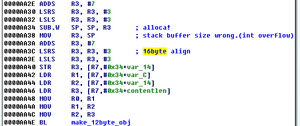

# wdub

wdub1 is static compiled ARMv7 binary. For some reason, IDA won't disassemble the binary correctly. We have to manually override the CPU architecture setting to ARMv7-M, then again, manually disassemble the instruction in Thumb mode with IDA's `MakeCode` functionality.



The real main routine is at 0x9210



Strace tells us that wdub1 sets ALARM timer, also it can't be run from terminal (Socket operation on non-socket).



So what we need to do in order to debug this binary is:

1. Disable alarm
2. Redirect I/O to socket.

But the binary is static compiled and stripped. so it is difficult to disable alarm by patching. so we use signal masking to disable SIGALRM.

```c
#include <stdio.h>
#include <signal.h>
int main(){
        sigset_t signal_set;
        sigaddset(&signal_set, SIGALRM);
        sigprocmask(SIG_BLOCK, &signal_set, NULL);
        char* args[] = {"./wdub", 0};
        execve(args[0], args, 0);
        return 0;
}
```

After disable the alarm and redirect the I/O with xinet.d, we can run the binary and debug it.



At 0xc3b2 ~ 0xc3c2 the HTTP request object (12byte) is created.



HTTP request object is consisted with [size], [????], [pointer to request string]




The request string is parsed and processed according to `GET`, `POST`, `OPTION`, `TRACE`, `PATCH`...




While parsing `PATCH` request, it calculates the size of `Content-Length` which is `unsigned int` and checks if its smaller than 2000 bytes., however, while processing `X-Offset Header`, the value is treated as 'signed int', so we can bypass size limit by passing `X-Offset` value negative.
This creates integer overflow bug, and lets us overflow the stack buffer.







The `PATCH` request loads the existing file to stack buffer size of `'Content-Length + X-Offset'`.

So, first, we PATCH the `index.html` into size of N, then we `PATCH` again with negative X-Offset value in order to read index.html into small size of stack buffer.



With such two `PATCH` request, we can overflow `alloca` stack buffer. and we can get PC control

After, this step, we can ROP to execute `execve("/bin/sh")`.

Since, there is no ASLR, and the binary uses deterministic heap memory allocator, we can put any data at known memory address. so we put "/bin/sh" and the address of "/bin/sh" and pass them to R0, R1. and we set R2(environ) to 0 then we jump to SVC 0 gadget with R7=11 (sys_execve).
We could find such gadgets, from code section.

```py
'''
.text:0000D95E 28 46                                   MOV     R0, R5
.text:0000D960 31 46                                   MOV     R1, R6
.text:0000D962 3A 46                                   MOV     R2, R7
.text:0000D964 98 47                                   BLX     R3
'''
GADGET = 0xd95e+1
SVC = 0xd9b4+1          # .text:0000D9B4       SVC     0
R3PC = 0x1b476+1        # .text:0001B476       POP     {R3,PC}
R7PC = 0x8a50+1         # .text:00008A50       POP     {R7,PC}
```

After ROP, we get shell.
